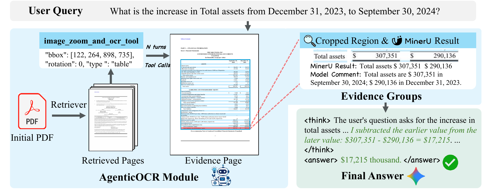
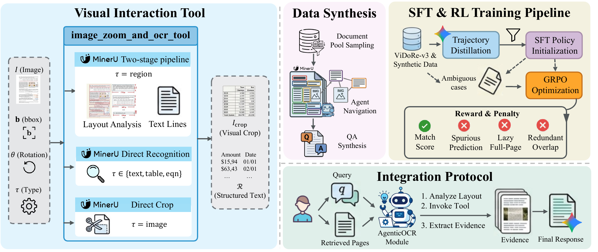

<h2 align="center">AgenticOCR: Parsing Only What You Need<br>for Efficient Retrieval-Augmented Generation</h2>

<p align="center">
  <a href="https://arxiv.org/abs/2602.24134"></a>
  <a href="https://huggingface.co/zr-wang/AgenticOCR-4B"></a>
  <a href="https://huggingface.co/zr-wang/AgenticOCR-8B"></a>
  <a href="https://huggingface.co/datasets/zr-wang/AgenticOCR-SFT"></a>
  <a href="https://huggingface.co/datasets/zr-wang/AgenticOCR-RL"></a>
</p>

<p align="center">
  <b>Turn OCR from static full-page preprocessing into query-driven, on-demand visual evidence extraction.</b>
</p>

<h5 align="center">If you find this project useful, please consider giving it a star ⭐.</h5>

## 💡 Overview

Visual document RAG systems usually retrieve and forward entire pages to a generator. This coarse page-level interface introduces irrelevant visual context, dilutes attention, and compresses fine-grained evidence—such as small text, rotated tables, charts, and equations—into a limited visual-token budget.

**AgenticOCR** is a query-driven parsing module that sits between page retrieval and answer generation. Given a query and retrieved page images, it reasons over document layout, identifies relevant regions, and invokes an `image_zoom_and_ocr_tool` to crop, rotate, and recognize only the evidence needed by the generator.

AgenticOCR is designed as a plug-and-play **third building block** for visual document RAG, complementing embedding and reranking modules:

1. **Query-driven parsing** — parse only regions relevant to the current information need.
2. **Thinking with images** — iteratively inspect, zoom, rotate, and OCR complex document elements.
3. **Evidence-level generation** — pass compact visual crops and structured OCR evidence to the generator instead of noisy full pages.

<p align="center">
  
</p>

<p align="center">
  <i>AgenticOCR retrieves relevant pages, extracts query-specific evidence groups with visual tools, and forwards compact evidence to the answer generator.</i>
</p>

## ✨ Highlights

- **On-demand visual decompression:** selectively recovers high-resolution information exactly where it is needed.
- **Multiple document element types:** supports regions, text, tables, equations, and image crops.
- **Traceable evidence:** returns OCR content and bounding boxes normalized to the original page coordinate system.
- **Model-agnostic integration:** works with OpenAI-compatible extractor and generator endpoints.
- **End-to-end evaluation:** includes retrieval, generation, caching, and benchmark-specific evaluation for MMLongBench-Doc and FinRAGBench-V.
- **Scalable data synthesis:** provides an automated pipeline for document parsing, evidence-chain construction, QA generation, verification, and filtering.

## 🔧 Installation

The reference environment uses **Python 3.12** and **CUDA 12.8**.

```bash
git clone https://github.com/opendatalab/AgenticOCR.git
cd AgenticOCR

conda create -n agenticocr python=3.12 -y
conda activate agenticocr

# Core pipeline dependencies
pip install -r requirements.txt
pip install mineru_vl_utils==0.1.20
```

For an environment matching the development setup, install the pinned full dependency set:

```bash
pip install -r requirements_full.txt
```

> [!NOTE]
> The full pipeline expects GPU-backed OCR, evidence-extractor, reranker, and generator services or checkpoints. The repository provides OpenAI-compatible service wrappers and launch-script templates under `scripts/`; update all model paths, ports, and GPU assignments before use.

## 🏃 Quick Start

### 1. Prepare a configuration

```bash
cp configs/template.yaml configs/my_run.yaml
```

At minimum, update the following fields in `configs/my_run.yaml`:

| Component | Configuration fields | Description |
| --- | --- | --- |
| Benchmark | `benchmark`, `data_root` | `mmlong` or `finrag`, plus the local dataset root |
| Output | `output_dir` | Experiment outputs and per-sample caches |
| Retriever | `reranker_model` or `reranker_api_base` | Local Qwen3-VL reranker checkpoint or HTTP service |
| AgenticOCR | `extractor_model_name`, `extractor_base_url`, `extractor_api_key` | OpenAI-compatible evidence-extractor endpoint |
| OCR tool | `mineru_server_url`, `mineru_model_path` | MinerU OCR service and model identifier/path |
| Generator | `model_name`, `base_url`, `api_key` | OpenAI-compatible answer-generation endpoint |
| Context | `use_page`, `use_crop`, `use_ocr`, `use_ocr_both` | Evidence sent to the generator |

API keys may also be supplied through environment variables:

```bash
export RAG_API_KEY="<your-generator-api-key>"
export EXTRACTOR_API_KEY="<your-extractor-api-key>"
export EVALUATOR_API_KEY="<your-evaluator-api-key>"
```

### 2. Run the three-stage pipeline

```bash
# Stage 1: retrieve pages and extract query-relevant evidence
python run_retrieval.py \
  --config configs/my_run.yaml \
  --num_threads 10

# Stage 2: generate answers from the extracted evidence
python run_generation.py \
  --config configs/my_run.yaml \
  --num_threads 10

# Stage 3: evaluate retrieval and generation
python run_evaluation.py \
  --config configs/my_run.yaml \
  --evaluation_task all \
  --num_threads 4
```

For a small sanity run, add `--limit 5` to each command. Command-line arguments override values in the YAML configuration.

The pipeline writes the main artifacts below `output_dir`:

```text
output_dir/
├── retrieval_results.json
├── generation_results.jsonl
├── evaluation_metrics_all.json
├── cache_retrieval_results/
├── cache_generation_results/
└── workspace/crops/
```

## 🧩 How AgenticOCR Works

The `image_zoom_and_ocr_tool` accepts a normalized bounding box, rotation angle, and element type:

```json
{
  "name": "image_zoom_and_ocr_tool",
  "arguments": {
    "label": "the total assets row",
    "bbox": [122, 264, 898, 735],
    "angle": 0,
    "type": "table"
  }
}
```

Its behavior depends on the selected element type:

- `region`: run MinerU layout analysis followed by recognition of sub-elements.
- `text`, `table`, or `equation`: directly recognize the cropped target element.
- `image`: return the visual crop without OCR.

The model can invoke the tool over multiple rounds, inspect tool responses, and aggregate a self-contained evidence list with coordinates mapped back to the original page.

<p align="center">
  
</p>

<p align="center">
  <i>Visual interaction tool, automated data synthesis, SFT + GRPO training, and the visual RAG integration protocol.</i>
</p>

## 📚 Supported Benchmarks

### MMLongBench-Doc

Expected dataset structure:

```text
<data_root>/
└── data/
    ├── samples.json
    └── documents/
```

### FinRAGBench-V

Expected dataset structure:

```text
<data_root>/
└── data/
    ├── queries/
    │   ├── queries_ch.json
    │   └── queries_en.json
    ├── corpus/
    │   ├── ch/img/
    │   └── en/img/
    ├── qrels/
    │   ├── qrels_ch.tsv
    │   └── qrels_en.tsv
    └── citation_labels/citation_labels_new/
```

Download benchmark data separately and follow the licenses and terms of the original datasets.

## 🧪 Data Synthesis

`Data_Synthesis/` contains the automated **OmniDocSynth** pipeline used to construct document QA and evidence data:

1. Parse PDF pages and OCR/layout elements.
2. Build document outlines.
3. Generate multi-element evidence chains.
4. Select question templates and synthesize QA pairs.
5. Verify answerability and evidence relevance.
6. Rewrite questions, filter difficulty, and tag evidence necessity.

See [`Data_Synthesis/README.md`](Data_Synthesis/README.md) for environment variables, input formats, and step-by-step usage.

## 📁 Repository Structure

```text
AgenticOCR/
├── configs/                 # YAML configuration templates
├── prompts/                 # Generator prompts
├── scripts/                 # Service launchers and analysis utilities
├── src/
│   ├── agents/              # AgenticOCR, MinerU tool, and RAG orchestration
│   ├── loaders/             # MMLongBench-Doc and FinRAGBench-V loaders
│   ├── recalls/             # Qwen3-VL embedding/reranking components
│   └── utils/               # Evaluation, caching, IO, and LLM helpers
├── Data_Synthesis/          # OmniDocSynth data-generation pipeline
├── run_retrieval.py
├── run_generation.py
└── run_evaluation.py
```

## 📖 Citation

If you find AgenticOCR useful, please cite our paper:

```bibtex
@misc{wang2026agenticocr,
  title         = {AgenticOCR: Parsing Only What You Need for Efficient Retrieval-Augmented Generation},
  author        = {Zhengren Wang and Dongsheng Ma and Huaping Zhong and Jiayu Li and Wentao Zhang and Bin Wang and Conghui He},
  year          = {2026},
  eprint        = {2602.24134},
  archivePrefix = {arXiv},
  primaryClass  = {cs.CV},
  url           = {https://arxiv.org/abs/2602.24134}
}
```

## ❤️ Acknowledgements

This project builds on [MinerU](https://github.com/opendatalab/MinerU) for document parsing and the Qwen vision-language model ecosystem for retrieval, evidence extraction, and generation. We also thank the authors of MMLongBench-Doc and FinRAGBench-V for their valuable benchmarks.

## 📞 Contact

For questions or feedback, please open a GitHub issue or contact [wzr@stu.pku.edu.cn](mailto:wzr@stu.pku.edu.cn).
